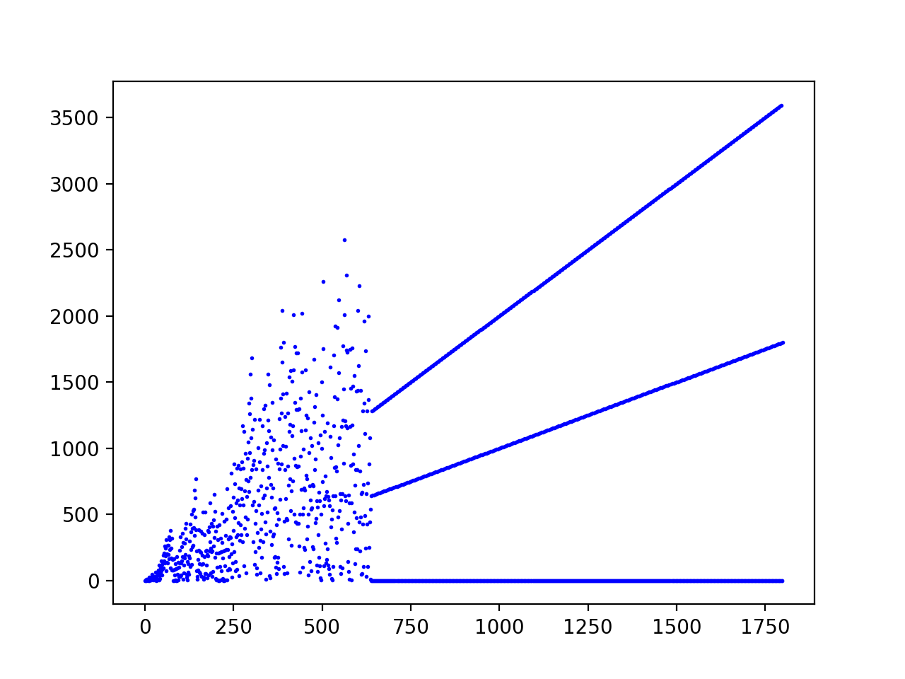
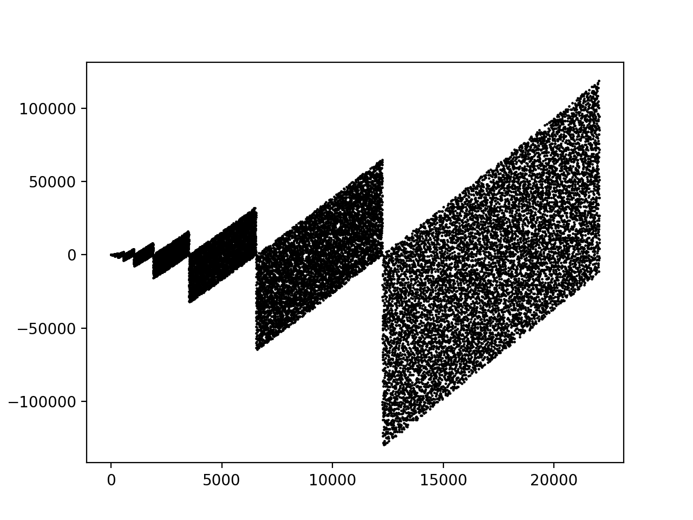
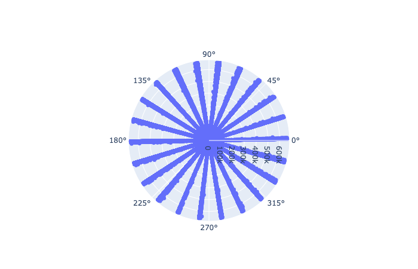

# Visualizations
## Visualizations practice with python/matplotlib/numpy/pygame. 

  * A* Pathfinding Algorithm.
 

  * "Fly straight, dammit!" graph output.

  * "nth prime minus its binary reversal"
 

  * "Prime gap plotted on polar graph"
 

